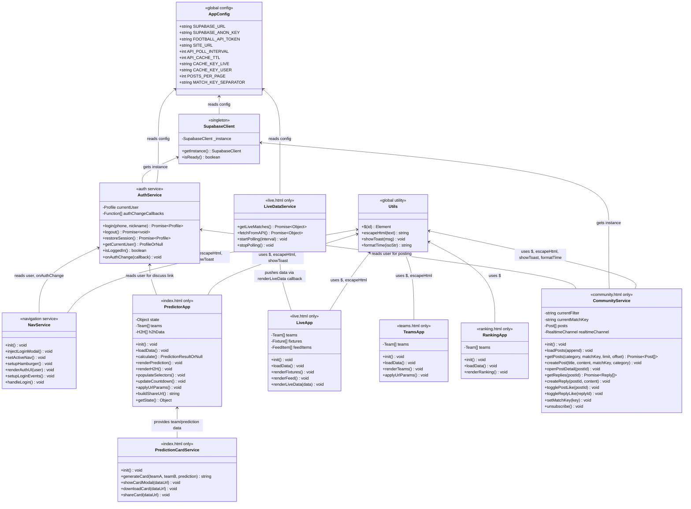
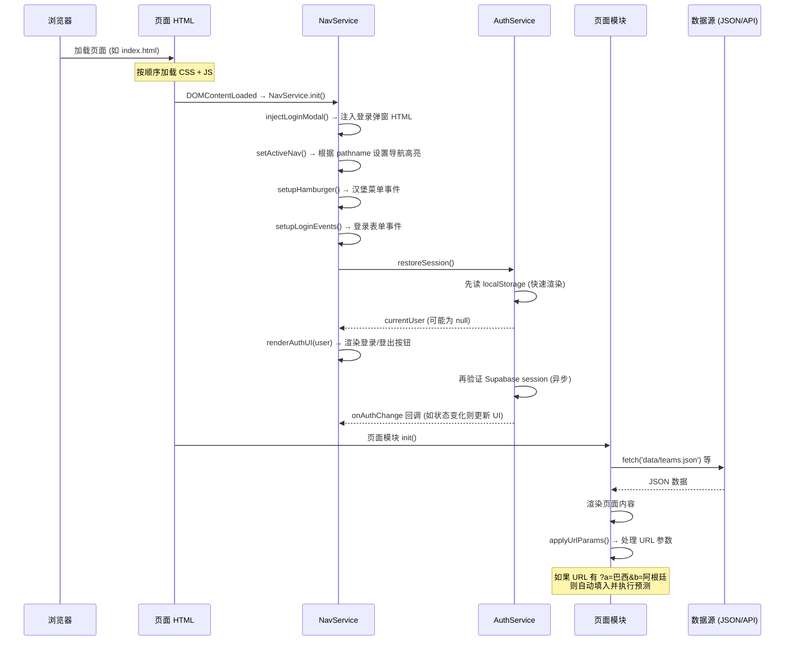
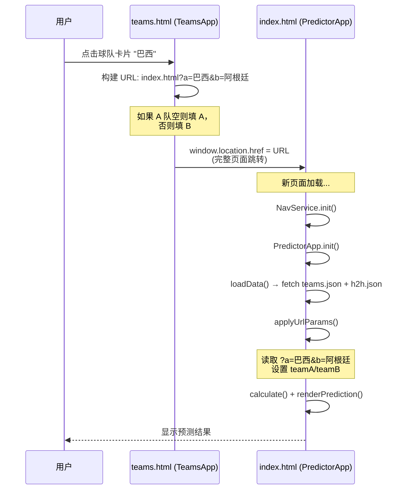
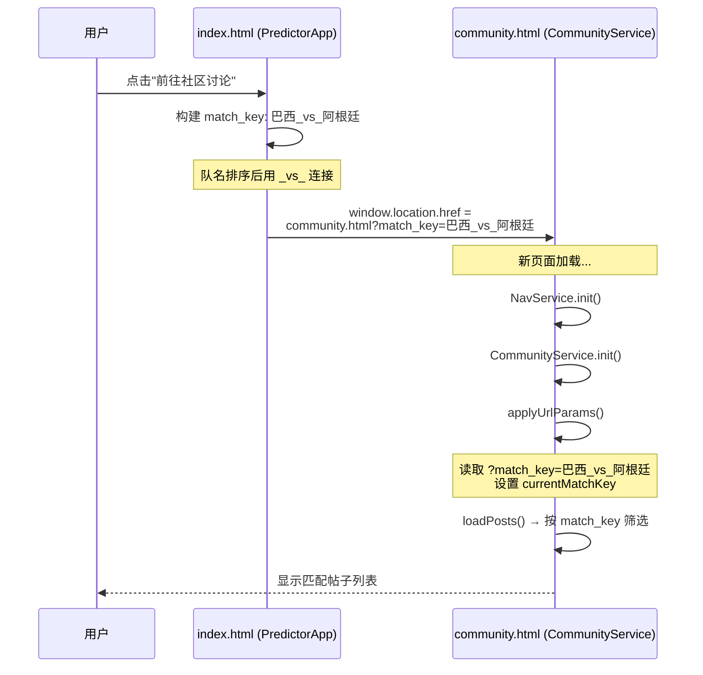
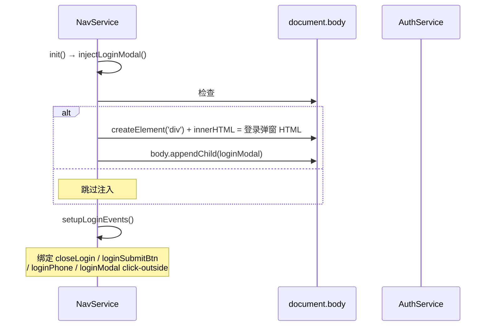
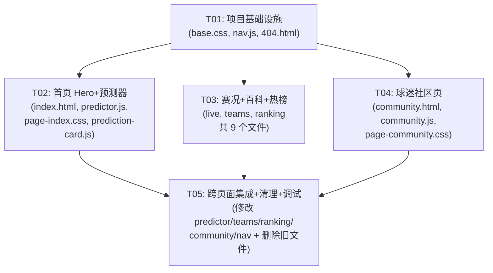

# 世界杯胜率预测台 — 多页面重构架构设计

> 架构师：高见远（Gao） | 版本：v2.0 (多页面重构) | 日期：2026-05-21

---

## Part A: 系统设计

### 1. 实现方案 + 框架选型

#### 1.1 核心技术挑战

| # | 挑战 | 分析 | 方案 |
|---|------|------|------|
| C1 | app.js 550 行拆分 | 单文件包含预测算法、球队百科、热榜、倒计时、认证UI、事件绑定等所有逻辑 | 按页面职责拆分为 predictor.js / live.js / teams.js / ranking.js + 新增 nav.js；认证 UI 迁入 nav.js |
| C2 | style.css 235 行拆分 | 单文件包含所有板块样式，需要按页拆分 | 提取 base.css（全局变量+重置+导航+Tab栏+弹窗+Toast）+ 5 个 page-*.css |
| C3 | 跨页面状态丢失 | 多页面间无共享内存，登录状态、用户信息需跨页面持久 | localStorage 持久化用户信息（已有 wc_user key）；Supabase Auth session 自动持久 |
| C4 | 登录弹窗全局共享 | 每个页面都需要登录弹窗，但 HTML 不能复用 | nav.js 动态注入登录弹窗 HTML 到每个页面 body；认证逻辑由 auth.js 统一处理 |
| C5 | 底部 Tab 栏 iOS 微信兼容 | `position: fixed` 在 iOS 微信浏览器中偶发不稳定 | 使用 `-webkit-overflow-scrolling: touch` + `safe-area-inset-bottom` + body 底部 padding 预留空间 |
| C6 | live-data.js 回调耦合 | 现有 `window.App.renderLiveData` 硬编码回调 | 改为 `window.LiveApp.renderLiveData`（LiveApp 为 live.html 专属模块）；仅在 live.html 加载时注册 |
| C7 | 页面间跳转传参 | 球队百科→预测器需要传队名，预测器→社区需要传 match_key | 统一 URL 参数协议：`?a=` / `?b=` / `?match_key=` / `?highlight=` / `?post=` |

#### 1.2 框架选型

| 类别 | 选型 | 理由 |
|------|------|------|
| 前端框架 | **无框架，纯 HTML/CSS/JS** | 保持现有技术栈，无构建工具，GitHub Pages 直接部署 |
| 后端/BaaS | **Supabase**（免费版，已有） | 社区功能已实现，无需变更 |
| UI 组件 | **现有 CSS 变量体系** | 深色主题一致性，不引入新组件库 |
| 二维码 | **QRCode.js**（已有） | 仅首页加载 |
| 图片生成 | **Canvas API**（已有） | prediction-card.js 不变 |
| HTTP 客户端 | **原生 fetch**（已有） | 无需额外库 |

#### 1.3 架构模式

从**模块化单页应用**重构为**多页面静态站点（MPA）**：

- **5 个独立 HTML 页面**，每个页面加载自己专属的 CSS + JS
- **公共层**（config / utils / supabase-client / auth / nav）所有页面共享
- **页面间无共享内存状态**，通过 URL 参数 + localStorage 传递上下文
- **底部 Tab 栏 + 顶部导航栏**由 nav.js 统一管理
- 导航跳转使用原生 `<a href="xxx.html">`，不用 `pushState`（微信兼容性）

---

### 2. 文件列表

```
mbti-cosmos-refactor/
├── index.html                    # [修改] 重写为首页（Hero + 预测器 + 预测卡片弹窗）
├── live.html                     # [新增] 实时赛况页
├── teams.html                    # [新增] 球队百科页
├── ranking.html                  # [新增] 夺冠热榜页
├── community.html                # [新增] 球迷社区页
├── 404.html                      # [新增] 404 兜底页
├── css/
│   ├── base.css                  # [新增] 全局变量、重置、导航、Tab栏、弹窗、Toast、认证UI
│   ├── page-index.css            # [新增] 首页样式（Hero + 预测器 + H2H + 分享 + 讨论入口）
│   ├── page-live.css             # [新增] 赛况页样式（实时流 + 赛程卡片 + 数据来源）
│   ├── page-teams.css            # [新增] 百科页样式（搜索筛选 + 球队卡片网格）
│   ├── page-ranking.css          # [新增] 热榜页样式（分档排行卡片）
│   ├── page-community.css        # [新增] 社区页样式（帖子列表 + 发帖/详情弹窗 + 回复）
│   └── style.css                 # [删除] 被 base.css + page-*.css 替代
├── js/
│   ├── config.js                 # [保留] 全局配置（不变）
│   ├── utils.js                  # [保留] 公共工具（不变）
│   ├── supabase-client.js        # [保留] Supabase 单例（不变）
│   ├── auth.js                   # [保留] 认证服务（不变）
│   ├── nav.js                    # [新增] 导航高亮 + Tab 切换 + 登录弹窗注入 + 认证 UI
│   ├── predictor.js              # [新增] 从 app.js 拆出：预测算法 + 渲染 + 倒计时 + URL 参数
│   ├── prediction-card.js        # [修改] 适配：window.App → window.PredictorApp
│   ├── live.js                   # [新增] 从 app.js 拆出：赛况渲染 + 赛程列表 + 资讯流 + 倒计时数据
│   ├── live-data.js              # [修改] 适配：回调从 window.App → window.LiveApp
│   ├── teams.js                  # [新增] 从 app.js 拆出：球队搜索/筛选 + 卡片渲染 + 点击跳转
│   ├── ranking.js                # [新增] 从 app.js 拆出：Elo 排序 + 分档渲染
│   ├── community.js              # [修改] 适配：URL 参数处理 + beforeunload 清理 + 去除页面内滚动
│   └── app.js                    # [删除] 功能已拆入 predictor.js / live.js / teams.js / ranking.js / nav.js
├── data/                         # [保留] 所有 JSON 数据不变
│   ├── teams.json
│   ├── fixtures.json
│   ├── feed.json
│   └── h2h.json
├── img/                          # [保留] 不变
├── supabase/                     # [保留] 不变
└── docs/                         # [保留]
```

**变更统计**：
- 新增：10 个文件（5 HTML + 6 CSS + 5 JS - 1 404 = 15，减去已有文件）
- 修改：3 个文件（prediction-card.js, live-data.js, community.js）
- 删除：2 个文件（style.css, app.js）
- 保留：6 个文件（config.js, utils.js, supabase-client.js, auth.js, data/*, img/*）

---

### 3. 数据结构和接口

#### 3.1 JS 模块依赖关系（类图）



#### 3.2 页面与 JS/CSS 加载映射

| 页面 | 加载的 CSS | 加载的 JS（按顺序） |
|------|-----------|-------------------|
| index.html | base.css + page-index.css | config → utils → supabase-client → auth → nav → **predictor** → prediction-card |
| live.html | base.css + page-live.css | config → utils → supabase-client → auth → nav → live-data → **live** |
| teams.html | base.css + page-teams.css | config → utils → supabase-client → auth → nav → **teams** |
| ranking.html | base.css + page-ranking.css | config → utils → supabase-client → auth → nav → **ranking** |
| community.html | base.css + page-community.css | config → utils → supabase-client → auth → nav → **community** |
| 404.html | base.css | config → utils → nav |

#### 3.3 页面间数据传递协议（URL 参数）

| 参数 | 格式 | 来源页面 | 目标页面 | 目标页面行为 |
|------|------|----------|----------|-------------|
| `a` | `?a=巴西` | teams.html, ranking.html | index.html | 自动填入 A 队选择器并执行预测 |
| `b` | `?b=阿根廷` | teams.html, ranking.html | index.html | 自动填入 B 队选择器并执行预测 |
| `mode` | `?mode=knockout` | 外部分享链接 | index.html | 设置淘汰赛模式 |
| `match_key` | `?match_key=巴西_vs_阿根廷` | index.html | community.html | 按 match_key 自动筛选帖子 |
| `highlight` | `?highlight=法国` | ranking.html | teams.html | 滚动到该球队卡片并高亮 |
| `post` | `?post=123` | 外部分享链接 | community.html | 自动打开帖子详情弹窗 |

**参数读取约定**：各页面模块在 `init()` 中调用 `applyUrlParams()`，使用 `new URLSearchParams(window.location.search)` 读取。

#### 3.4 共享 HTML 结构模板

每个页面共享以下 HTML 骨架（以 index.html 为例）：

```html
<!DOCTYPE html>
<html lang="zh-CN">
<head>
  <meta charset="UTF-8">
  <meta name="viewport" content="width=device-width,initial-scale=1,viewport-fit=cover">
  <!-- 页面专属 meta -->
  <title>首页 - 世界杯胜率预测台</title>
  <script src="https://cdn.jsdelivr.net/npm/@supabase/supabase-js@2/dist/umd/supabase.min.js"></script>
  <!-- 仅首页加载 QRCode.js -->
  <script src="https://cdn.jsdelivr.net/npm/qrcodejs@1.0.0/qrcode.min.js"></script>
  <link rel="stylesheet" href="css/base.css">
  <link rel="stylesheet" href="css/page-index.css">
</head>
<body>
<div class="page">
  <!-- 顶部导航栏（所有页面一致） -->
  <header class="topbar">
    <div class="topbar-inner">
      <a href="index.html" class="brand"><span>⚽</span><span>世界杯胜率预测台</span></a>
      <nav id="mainNav">
        <a href="index.html">预测器</a>
        <a href="live.html">实时赛况</a>
        <a href="teams.html">球队百科</a>
        <a href="ranking.html">夺冠热榜</a>
        <a href="community.html">球迷社区</a>
        <span id="authArea" class="auth-area"></span>
      </nav>
      <button class="hamburger" id="hamburger" aria-label="菜单">
        <span></span><span></span><span></span>
      </button>
    </div>
  </header>
  <div class="mobile-nav" id="mobileNav">
    <a href="index.html">预测器</a>
    <a href="live.html">实时赛况</a>
    <a href="teams.html">球队百科</a>
    <a href="ranking.html">夺冠热榜</a>
    <a href="community.html">球迷社区</a>
    <span id="authAreaMobile" class="auth-area"></span>
  </div>

  <!-- ====== 页面专属内容 ====== -->
  <main>
    <!-- 由各页面自行填写 -->
  </main>
</div>

<!-- 底部 Tab 栏（所有页面一致，移动端显示） -->
<nav class="tab-bar" id="tabBar">
  <a href="index.html"><span class="tab-icon">🏠</span><span class="tab-label">首页</span></a>
  <a href="live.html"><span class="tab-icon">⚽</span><span class="tab-label">赛况</span></a>
  <a href="community.html"><span class="tab-icon">🏟</span><span class="tab-label">社区</span></a>
  <a href="ranking.html"><span class="tab-icon">📊</span><span class="tab-label">热榜</span></a>
  <a href="teams.html"><span class="tab-icon">📖</span><span class="tab-label">百科</span></a>
</nav>

<!-- 登录弹窗由 nav.js 动态注入 -->

<!-- 页面专属弹窗（如首页的预测卡片弹窗、社区的发帖/详情弹窗） -->

<!-- 公共 JS -->
<script src="js/config.js"></script>
<script src="js/utils.js"></script>
<script src="js/supabase-client.js"></script>
<script src="js/auth.js"></script>
<script src="js/nav.js"></script>
<!-- 页面专属 JS -->
<script src="js/predictor.js"></script>
<script src="js/prediction-card.js"></script>
</body>
</html>
```

---

### 4. 程序调用流程

#### 4.1 页面加载 → 初始化 → 数据获取 → 渲染



#### 4.2 跨页面跳转流程（球队百科 → 首页预测器）



#### 4.3 跨页面跳转流程（预测器 → 社区讨论）



#### 4.4 登录弹窗动态注入流程



---

### 5. 待明确事项

| # | 问题 | 当前假设 | 风险等级 |
|---|------|----------|----------|
| 1 | iOS 微信浏览器 `position: fixed` 稳定性 | 使用 `safe-area-inset-bottom` + body padding-bottom 预留空间作为 fallback | 中 — 需真机测试 |
| 2 | 球队百科点击球队跳转首页后，首页 teams.json 加载完成前无法自动填入 | predictor.js 先 loadData 再 applyUrlParams，保证数据就绪后执行 | 低 |
| 3 | 社区 Realtime 订阅在页面切换后是否需要清理 | community.js 在 `beforeunload` 时调用 `unsubscribe()`；重新进入时 `init()` 重新订阅 | 低 |
| 4 | style.css 拆分后是否有大量重复 | 导航/Tab/弹窗/Toast 在 base.css；各页面专属样式独立，预计重复 < 5% | 低 |
| 5 | 各页面独立加载 teams.json 是否浪费带宽 | 文件约 10KB gzip 后约 3KB，可接受；P1 阶段可加 Service Worker 缓存 | 低 |
| 6 | prediction-card.js 中 `window.App.buildShareUrl` 需要改为 `window.PredictorApp.buildShareUrl` | 确认修改，同时 QRCode 生成依赖的 URL 仍正确 | 低 |
| 7 | 帖子详情弹窗是否需要 `community.html?post=123` 直接打开 | P0 支持：community.js 的 `applyUrlParams()` 读取 `?post=` 参数后自动调用 `openPostDetail()` | 低 |

---

## Part B: 任务分解

### 6. 依赖包列表（CDN）

| 包名 | 版本 | CDN URL | 加载页面 | 用途 |
|------|------|---------|----------|------|
| Supabase JS SDK | ^2 | `https://cdn.jsdelivr.net/npm/@supabase/supabase-js@2/dist/umd/supabase.min.js` | 所有页面 | Auth + DB + Realtime |
| QRCode.js | 1.0.0 | `https://cdn.jsdelivr.net/npm/qrcodejs@1.0.0/qrcode.min.js` | 仅 index.html | 预测卡片二维码 |

**无需 npm 包** — Canvas API、fetch、localStorage、URLSearchParams 均为浏览器原生能力。

---

### 7. 任务列表

#### T01: 项目基础设施（公共层 + 导航系统 + 404 页面）

- **源文件**：
  - `css/base.css`（新增，从 style.css 提取全局样式 + 新增 Tab 栏样式）
  - `js/nav.js`（新增，导航高亮 + Tab 切换 + 登录弹窗注入 + 认证 UI 渲染）
  - `404.html`（新增，404 兜底页）
  - `css/style.css`（删除，被 base.css + page-*.css 替代）
  - `js/app.js`（删除，功能已拆入各页面模块）
- **依赖**：无
- **优先级**：P0
- **详细说明**：
  1. **base.css** 提取范围：
     - `:root` CSS 变量（--bg, --panel, --text, --green 等）
     - 全局重置（*, html, body, button/input/select/textarea, a, ::selection, scrollbar）
     - 布局（.page, .shell）
     - 顶部导航栏（.topbar, .topbar-inner, .brand, nav, nav a, .hamburger）
     - 移动端导航（.mobile-nav, .mobile-nav.show）
     - **新增**底部 Tab 栏样式：`.tab-bar`（fixed bottom, flex 布局, 5 个 Tab, 安全区域适配）
     - 按钮通用（.btn, .btn-primary, .btn-ghost）
     - 板块通用（.section, .section-head, .section-kicker, section h2, .section-note）
     - 登录弹窗（.login-modal, .login-card 及其子元素）
     - 认证 UI（.auth-area, .auth-user, .auth-login-btn）
     - Modal 通用（.modal-overlay, .modal-card）
     - Toast 样式
     - 页脚（.sources）
     - 响应式断点（@media max-width:768px / 480px）中导航/Tab 相关部分
  2. **base.css 新增 Tab 栏样式**：
     ```css
     .tab-bar {
       display: none; /* 桌面端隐藏 */
       position: fixed;
       bottom: 0;
       left: 0;
       right: 0;
       z-index: 100;
       background: rgba(11,17,16,.92);
       backdrop-filter: blur(12px);
       border-top: 1px solid var(--line);
       padding: 6px 0;
       padding-bottom: calc(6px + env(safe-area-inset-bottom, 0px));
       justify-content: space-around;
     }
     .tab-bar a { display:flex; flex-direction:column; align-items:center; gap:2px; font-size:10px; color:var(--muted); text-decoration:none; padding:4px 8px; }
     .tab-bar a .tab-icon { font-size:18px; }
     .tab-bar a.active { color:var(--green); }
     @media(max-width:768px) { .tab-bar { display:flex; } }
     ```
  3. **nav.js** 实现 `window.NavService`：
     - `injectLoginModal()`：检查 `#loginModal` 是否存在，不存在则创建并 append 到 body
     - `setActiveNav()`：根据 `window.location.pathname` 提取当前页面文件名，为 topbar nav / mobile-nav / tab-bar 中匹配的 `<a>` 添加 `.active` 类
     - `setupHamburger()`：绑定 hamburger 点击事件 toggle mobileNav
     - `renderAuthUI(user)`：从 app.js 迁移，渲染 authArea / authAreaMobile 内容（登录按钮或用户信息+退出）
     - `setupLoginEvents()`：从 app.js 迁移，绑定 closeLogin / loginSubmitBtn / loginPhone / loginModal 背景点击
     - `handleLogin()`：从 app.js 迁移，调用 AuthService.login 或本地降级登录
     - `init()`：按顺序调用上述函数 + AuthService.restoreSession() + AuthService.onAuthChange(renderAuthUI)
  4. **404.html**：包含 topbar + tab-bar + 简洁 404 提示 + "返回首页" 按钮，仅加载 base.css + nav.js
  5. 删除 `css/style.css` 和 `js/app.js`（此时暂不删，等 T02-T04 完成后统一清理）
- **验收标准**：
  - base.css 包含所有全局样式，Tab 栏在移动端正确显示
  - nav.js 能正确注入登录弹窗、设置导航高亮、处理登录/登出
  - 404.html 可独立访问，导航正常
  - 现有 index.html 暂时不受影响（仍加载 style.css + app.js）

---

#### T02: 首页（Hero + 预测器 + 预测卡片）

- **源文件**：
  - `index.html`（重写，从 320 行精简为首页专属 HTML）
  - `js/predictor.js`（新增，从 app.js 提取预测器逻辑）
  - `css/page-index.css`（新增，从 style.css 提取首页样式）
  - `js/prediction-card.js`（修改，适配 window.PredictorApp）
- **依赖**：T01
- **优先级**：P0
- **详细说明**：
  1. **index.html 重写**：
     - 保留：`<head>` meta + CDN + CSS 引入（base.css + page-index.css）
     - 保留：topbar + mobile-nav + tab-bar HTML
     - 保留：Hero 区域（倒计时 + 开幕战信息 + 快捷入口）
     - 保留：免责声明
     - 保留：`#predictor` 区域（预测表单 + 结果面板 + H2H + 讨论入口）
     - 保留：预测卡片弹窗 `#cardPreviewModal`
     - 移除：`#live` / `#teams` / `#ranking` / `#community` 区域
     - 移除：发帖弹窗 `#newPostModal` + 帖子详情弹窗 `#postDetailModal`
     - JS 加载顺序：config → utils → supabase-client → auth → nav → **predictor** → prediction-card
     - 讨论"前往社区讨论"按钮改为 `window.location.href = 'community.html?match_key=...'`
  2. **predictor.js** 从 app.js 提取以下内容，实现 `window.PredictorApp`：
     - `state` 对象（teamA, teamB, formA, formB, tempo, venue, mode）
     - `teams` / `h2hData` 数组
     - `clamp()`, `derived()`, `poisson()`, `scoreProjection()`, `calculate()` — 预测算法（原样迁移）
     - `loadData()` — 仅加载 teams.json + h2h.json
     - `populateSelectors()` — 填充 teamA/teamB 下拉框 + groupFilter/confedFilter
     - `renderPrediction()`, `renderH2H()` — 渲染预测结果和历史交锋
     - `updateCountdown()` — 倒计时（需要 fixtures.json 中的首场赛程日期）
     - `applyUrlParams()` — 读取 ?a= / ?b= / ?mode= 参数
     - `buildShareUrl()` — 构建分享 URL（使用 index.html 作为 base）
     - `updateDiscussLink()` — 改为跳转到 `community.html?match_key=...`（而非页面内滚动）
     - `setupShareEvents()` — 分享按钮事件
     - `setupEventHandlers()` — 预测器表单事件绑定（不包含 teams/ranking/live 的事件）
     - `init()` — loadData → updateCountdown → setupEventHandlers → PredictionCardService.init()
     - 公开接口：`calculate()`, `buildShareUrl()`, `getState()`
  3. **page-index.css** 从 style.css 提取：
     - Hero 区域（.hero, .hero-grid, .eyebrow, .hero h1, .hero-copy, .hero-actions, .hero-card）
     - 倒计时（.countdown, .count-cell, .count-val, .count-label）
     - 开幕战卡片（.fixture-mini, .fixture-teams, .fixture-city）
     - 免责声明（.disclaimer-bar）
     - 预测器（.predictor-grid, .control-panel, .field, .range-wrap, .range-val, .segmented, .mode-row）
     - 结果面板（.result-panel, .result-teams, .team-badge, .center-ball, .prob-list, .prob-row, .prob-bar-wrap, .prob-bar, .prob-pct, .insights, .insight-card, .verdict）
     - H2H（.h2h-box, .h2h-stats, .h2h-stat, .h2h-table）
     - 分享按钮（.share-btn）
     - 讨论区（.discuss-section, .discuss-input, .discuss-list, .discuss-item 等全部 discuss-* 样式）
     - 预测卡片弹窗（.card-preview, .card-actions, .btn-download, .btn-share）
     - 预测器响应式样式
  4. **prediction-card.js 修改**：
     - `window.App.buildShareUrl()` → `window.PredictorApp.buildShareUrl()`
     - `window.App` 引用 → `window.PredictorApp`
- **验收标准**：
  - index.html 可独立访问，Hero + 预测器功能完整
  - 选队 → 调参 → 预测 → 查看胜率/比分/倾向 → 历史交锋 → 分享卡片，流程通畅
  - URL 参数 `?a=巴西&b=阿根廷` 自动填入并执行预测
  - "前往社区讨论"按钮跳转到 `community.html?match_key=...`（而非页面内滚动）
  - 倒计时正常运行
  - 登录弹窗正常弹出，登录/登出功能正常
  - 移动端 Tab 栏正确显示，首页 Tab 高亮

---

#### T03: 实时赛况 + 球队百科 + 夺冠热榜（三个提取页面）

- **源文件**：
  - `live.html`（新增）
  - `js/live.js`（新增，从 app.js 提取赛况逻辑）
  - `css/page-live.css`（新增，从 style.css 提取赛况样式）
  - `teams.html`（新增）
  - `js/teams.js`（新增，从 app.js 提取球队百科逻辑）
  - `css/page-teams.css`（新增，从 style.css 提取百科样式）
  - `ranking.html`（新增）
  - `js/ranking.js`（新增，从 app.js 提取热榜逻辑）
  - `css/page-ranking.css`（新增，从 style.css 提取热榜样式）
  - `js/live-data.js`（修改，回调从 window.App → window.LiveApp）
- **依赖**：T01
- **优先级**：P0
- **详细说明**：
  1. **live.html + live.js + page-live.css**：
     - HTML：topbar + mobile-nav + tab-bar + `#live` 区域（赛事实时流 + 重点赛程 + 数据来源标注）+ `<script>` 加载（含 live-data.js）
     - live.js 实现 `window.LiveApp`：
       - `teams` / `fixtures` / `feedItems` 数组
       - `loadData()` — 加载 teams.json + fixtures.json + feed.json
       - `renderFixtures()` — 渲染重点赛程列表
       - `renderFeed()` — 渲染资讯流
       - `renderLiveData(data)` — 渲染实时比赛数据（从 app.js 迁移）
       - `init()` — loadData → 如果配置了 API_TOKEN 则启动 LiveDataService.startPolling()
     - live-data.js 修改：回调从 `window.App.renderLiveData` → `window.LiveApp.renderLiveData`
     - page-live.css：.live-layout, .live-panel, .panel-title, .live-dot, @keyframes pulse, .feed, .feed-item, .feed-tag, .feed-title, .feed-text, .fixture-card, .fixture-time, .fixture-score, .data-source + 响应式
     - 页面卸载时调用 `LiveDataService.stopPolling()`
  2. **teams.html + teams.js + page-teams.css**：
     - HTML：topbar + mobile-nav + tab-bar + 搜索/筛选工具栏 + `#teamsGrid` + `<script>` 加载
     - teams.js 实现 `window.TeamsApp`：
       - `teams` 数组
       - `loadData()` — 加载 teams.json
       - `populateFilters()` — 填充 groupFilter / confedFilter
       - `renderTeams()` — 渲染球队卡片网格（从 app.js 迁移 renderTeams）
       - `applyUrlParams()` — 读取 `?highlight=法国`，滚动到对应卡片并添加高亮动画
       - 卡片点击事件：改为 `window.location.href = 'index.html?a=' + encodeURIComponent(teamA) + '&b=' + encodeURIComponent(clickedTeam)`
       - `derived()` 函数 — 从 app.js 复制（teams 和 predictor 各自持有一份，不互相依赖）
       - `init()` — loadData → populateFilters → renderTeams → applyUrlParams → 事件绑定
     - page-teams.css：.team-tools, .teams-grid, .team-card 及其子元素, .meta-grid, .meta-box, .style-tags + 响应式
  3. **ranking.html + ranking.js + page-ranking.css**：
     - HTML：topbar + mobile-nav + tab-bar + `#rankingGrid` + `<script>` 加载
     - ranking.js 实现 `window.RankingApp`：
       - `teams` 数组
       - `loadData()` — 加载 teams.json
       - `renderRanking()` — Elo 排序分档渲染（从 app.js 迁移）
       - 球队行项点击：跳转 `index.html?a=队名` 或 `teams.html?highlight=队名`
       - `init()` — loadData → renderRanking → 事件绑定
     - page-ranking.css：.ranking-grid, .ranking-card, .tier, .dot, .tier-1~.tier-4, .rank-line, .rank-team, .rank-score + 响应式
- **验收标准**：
  - live.html：赛事实时流、重点赛程、数据来源标注正常显示；API 轮询正常；页面离开时停止轮询
  - teams.html：搜索/筛选功能正常；点击球队卡片跳转到 index.html 并带 URL 参数
  - ranking.html：四档展示正常；点击球队可跳转
  - 三个页面均可独立访问，导航高亮正确，Tab 栏正确显示
  - 登录弹窗在三个页面均可正常弹出

---

#### T04: 球迷社区页

- **源文件**：
  - `community.html`（新增）
  - `js/community.js`（修改，适配独立页面）
  - `css/page-community.css`（新增，从 style.css 提取社区样式）
- **依赖**：T01
- **优先级**：P0
- **详细说明**：
  1. **community.html**：
     - HTML：topbar + mobile-nav + tab-bar + 社区板块（社区标题+发帖按钮 + 分类筛选 + 帖子列表 + 加载更多）+ 发帖弹窗 `#newPostModal` + 帖子详情弹窗 `#postDetailModal` + `<script>` 加载
     - 注意：`#loginModal` 由 nav.js 动态注入，HTML 中不需要写
  2. **community.js 修改**：
     - 新增 `applyUrlParams()` 函数：
       - 读取 `?match_key=xxx`：设置 `currentMatchKey`，重置筛选为"全部"，刷新帖子列表
       - 读取 `?post=123`：自动调用 `openPostDetail(123)` 打开帖子详情弹窗
     - 新增 `beforeunload` 事件：调用 `unsubscribe()` 清理 Realtime 订阅
     - 修改 `init()` 流程：bindEvents → loadPosts → subscribeNewPosts → **applyUrlParams()**
     - 去除原有的 `setMatchKey` 中 `document.querySelector('#community').scrollIntoView` 逻辑（不再需要页面内滚动）
     - `setMatchKey()` 改为通过 URL 参数实现：`window.location.href = 'community.html?match_key=' + key`（但如果是本页内调用则直接设值刷新）
     - 公开接口新增 `applyUrlParams`
  3. **page-community.css** 从 style.css 提取：
     - 社区区域（.community-section, .community-header）
     - 发帖按钮（.btn-new-post）
     - 帖子卡片（.post-card, .post-title, .post-meta, .post-excerpt）
     - 社区筛选（.community-filters）
     - 帖子详情（.post-detail, .post-body）
     - 回复（.reply-item, .reply-author, .reply-content, .reply-time）
     - 回复输入（.reply-input-area）
     - 点赞按钮（.like-btn）
     - 提交按钮（.btn-submit）
- **验收标准**：
  - community.html 可独立访问，帖子列表正常加载
  - 分类筛选正常（全部/讨论/预测/资讯）
  - 发帖/回帖/点赞功能完整
  - URL 参数 `?match_key=巴西_vs_阿根廷` 自动筛选帖子
  - URL 参数 `?post=123` 自动打开帖子详情弹窗
  - Realtime 实时推送正常；页面离开时清理订阅
  - 登录弹窗正常弹出

---

#### T05: 跨页面跳转集成 + 旧文件清理 + 最终调试

- **源文件**：
  - `js/predictor.js`（修改，完善跳转链接）
  - `js/teams.js`（修改，完善卡片点击跳转）
  - `js/ranking.js`（修改，完善球队点击跳转）
  - `js/community.js`（修改，完善 setMatchKey 跳转逻辑）
  - `js/nav.js`（修改，添加 prefetch + 完善活跃状态）
  - `css/style.css`（删除）
  - `js/app.js`（删除）
- **依赖**：T02, T03, T04
- **优先级**：P0
- **详细说明**：
  1. **predictor.js 修改**：
     - `updateDiscussLink()` 确认跳转为 `window.location.href = 'community.html?match_key=' + encodeURIComponent(key)`
     - Hero 快捷入口按钮：`查看赛况` → `href="live.html"`
  2. **teams.js 修改**：
     - 球队卡片点击：构建 URL `index.html?a=已选队&b=点击队` 或 `index.html?a=点击队`（如果 A/B 都未选）
     - 使用 `encodeURIComponent` 编码队名
  3. **ranking.js 修改**：
     - 球队行项点击：跳转 `teams.html?highlight=队名` 或 `index.html?a=队名`
  4. **community.js 修改**：
     - `setMatchKey()` 如果从其他页面跳转来（URL 有 match_key），则直接设值刷新；如果是社区页面内调用则也直接设值刷新（不跳转）
  5. **nav.js 修改**：
     - 添加 `<link rel="prefetch">` 预加载逻辑：Tab 栏 hover/touchstart 时预加载目标页面（P1 功能，可选）
     - 完善 `setActiveNav()` 的 pathname 解析，兼容 GitHub Pages 子路径部署
  6. **旧文件清理**：
     - 确认所有功能迁移完毕后，删除 `css/style.css` 和 `js/app.js`
  7. **全站回归测试**：
     - 5 个页面均可独立访问，功能完整
     - 所有跨页面跳转正常（百科→预测、预测→社区、热榜→百科/预测）
     - 登录状态跨页面保持（localStorage + Supabase session）
     - 移动端 Tab 栏显示/隐藏正确，当前页高亮
     - 微信浏览器内测试 Tab 栏稳定性
     - 404.html 在无效路径下正确显示
- **验收标准**：
  - 所有跨页面跳转路径通畅，URL 参数正确传递和解析
  - 登录状态在页面切换后保持
  - 移动端 Tab 栏在微信浏览器中稳定
  - 旧文件已清理，无冗余代码
  - 全站功能无回归问题

---

### 8. 共享知识（跨文件约定）

```
1. 全局命名空间
   - 所有服务/模块挂载到 window 对象：
     window.AppConfig, window.Utils, window.SupabaseClient,
     window.AuthService, window.NavService,
     window.PredictorApp, window.PredictionCardService,
     window.LiveApp, window.LiveDataService,
     window.TeamsApp, window.RankingApp, window.CommunityService

2. CSS 变量约定
   - 全局变量定义在 css/base.css 的 :root 中
   - 所有页面共享同一套变量（--bg, --panel, --panel-2, --line, --text, --muted, --green, --green-2, --gold, --red, --blue, --ink, --shadow）
   - 页面专属 CSS 中只使用变量，不重新定义

3. JS 模块通信约定
   - 页面间不共享内存状态
   - 各页面独立加载所需 JSON 数据
   - 跨页面数据传递仅通过 URL 参数 + localStorage
   - 公共模块（config/utils/supabase-client/auth/nav）按固定顺序加载

4. 导航高亮约定
   - NavService.setActiveNav() 在每个页面 DOMContentLoaded 时执行
   - 通过 window.location.pathname 提取文件名（如 "index.html"）
   - 匹配的 <a> 标签添加 .active 类，颜色为 var(--green)
   - 桌面端 topbar nav 和移动端 tab-bar 同时设置高亮

5. URL 参数约定
   - 参数值使用 encodeURIComponent 编码
   - 读取使用 new URLSearchParams(window.location.search)
   - match_key 格式：队名按 Unicode 排序后 "_vs_" 连接（如 "巴西_vs_阿根廷"）
   - 队名参数直接使用中文名（如 ?a=巴西），需要 encodeURIComponent

6. Tab 栏约定
   - 移动端（≤768px）显示，桌面端隐藏
   - position: fixed, bottom: 0, z-index: 100
   - 使用 env(safe-area-inset-bottom) 适配 iOS 安全区域
   - body 需要 padding-bottom 预留 Tab 栏高度（约 56px + safe-area）

7. 登录弹窗约定
   - HTML 由 nav.js 动态注入到每个页面 body 末尾
   - 登录逻辑统一由 AuthService 处理
   - 登录状态通过 localStorage (wc_user) 跨页面持久化
   - NavService.renderAuthUI() 监听 AuthService.onAuthChange 自动更新

8. 脚本加载顺序约定
   - 公共层（所有页面）：config.js → utils.js → supabase-client.js → auth.js → nav.js
   - 页面层（各页面专属）：在公共层之后加载
   - 所有 <script> 放在 </body> 前，同步加载

9. 页面卸载清理约定
   - live.html: beforeunload → LiveDataService.stopPolling()
   - community.html: beforeunload → CommunityService.unsubscribe()
   - 其他页面无需特殊清理

10. 错误处理约定
    - 所有 fetch/SUPABASE 调用需 try/catch
    - 失败时使用 Utils.showToast() 提示，不使用 alert()
    - JSON 数据加载失败时展示友好提示，不白屏

11. CDN 依赖加载
    - Supabase JS SDK: 所有页面在 <head> 中加载
    - QRCode.js: 仅 index.html 在 <head> 中加载

12. 响应式断点
    - ≤768px: 移动端布局（隐藏桌面 nav，显示 hamburger + tab-bar，单列布局）
    - ≤480px: 小屏适配（热榜单列，倒计时 2 列，insight 单列）
```

---

### 9. 任务依赖图



**关键路径**：T01 → T02/T03/T04（可并行） → T05

**可并行**：T02、T03、T04 三个任务互不依赖，可同时开发。T01 是所有任务的前置条件。
