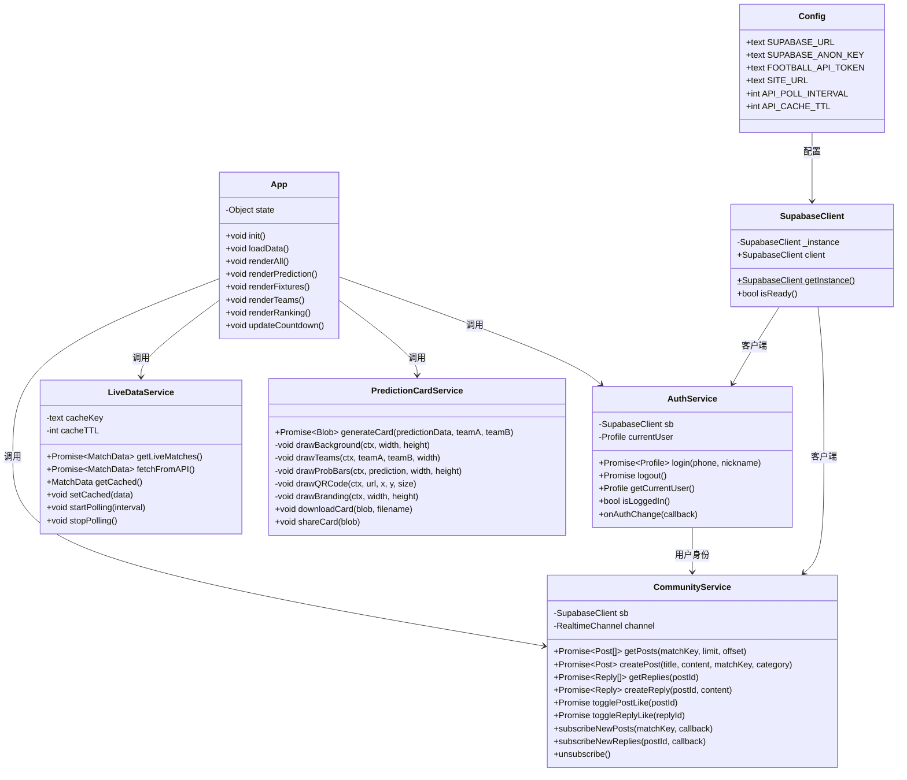
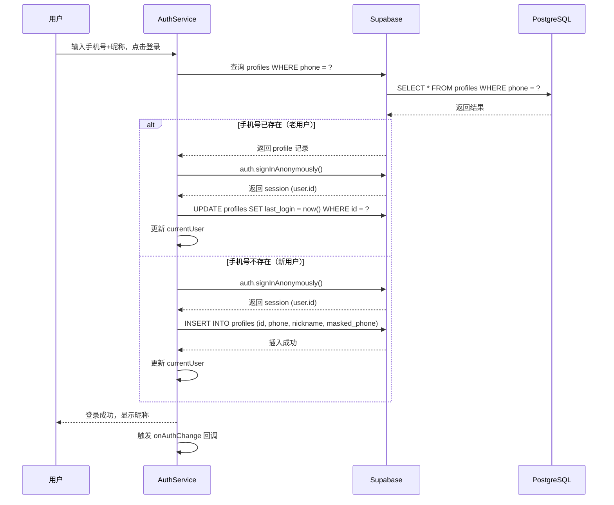
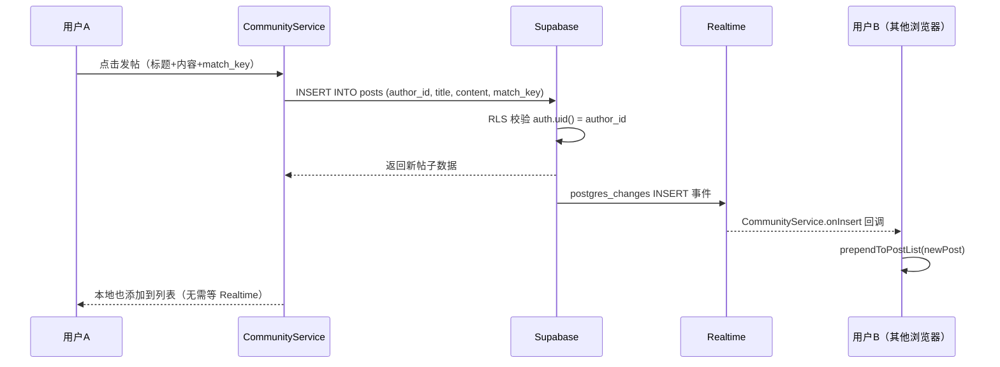
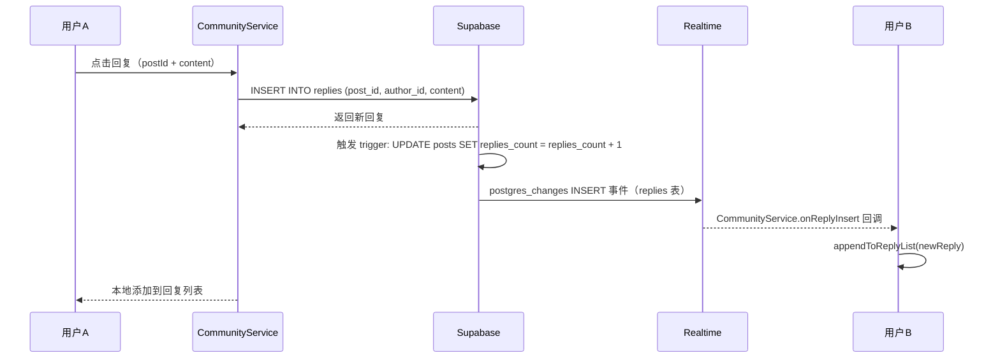
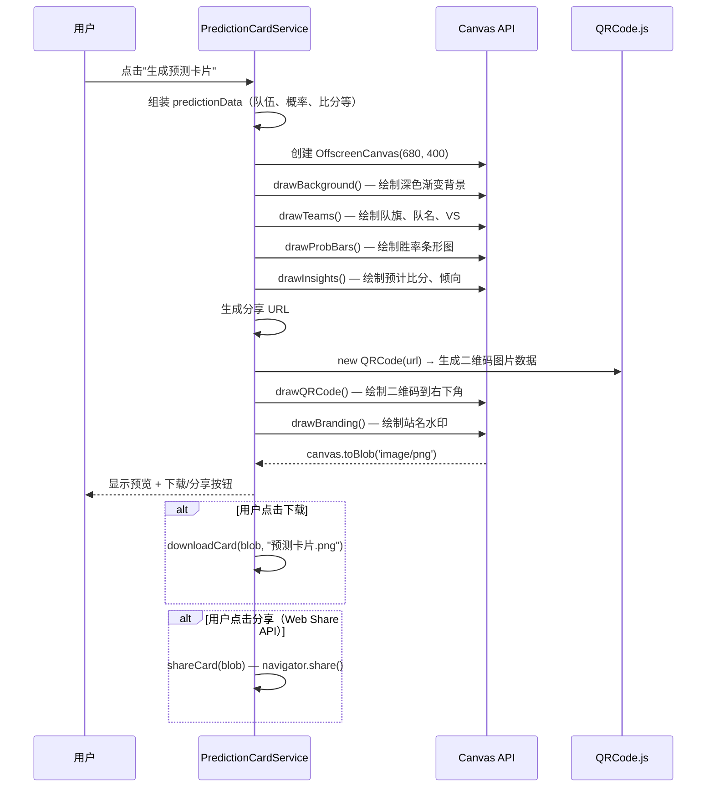
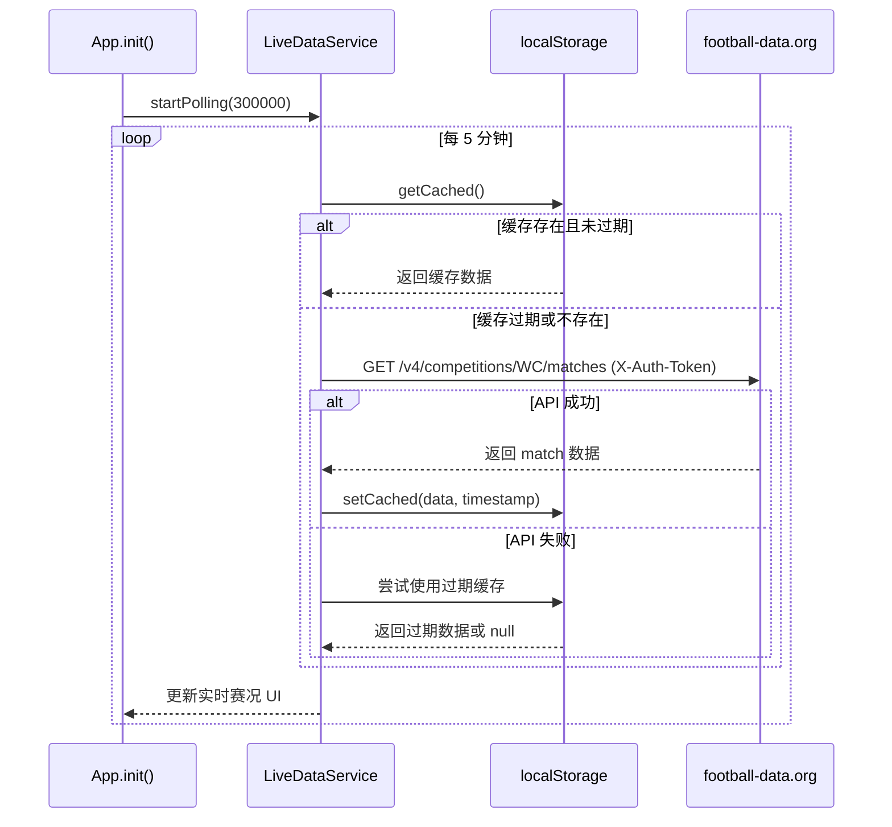
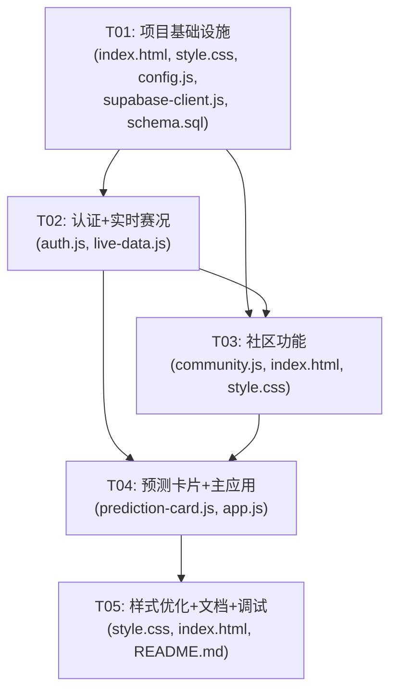

# 世界杯胜率预测台 — 系统架构设计

> 架构师：高见远（Gao） | 版本：v1.0 | 日期：2026-05-20

---

## Part A: 系统设计

### 1. 实现方案 + 框架选型

#### 核心技术挑战

| 挑战 | 分析 | 方案 |
|------|------|------|
| 手机号+昵称登录（无验证码） | Supabase Auth 不直接支持"手机号+昵称无验证码"模式 | 用 Supabase Auth 的匿名登录 + 自定义 `profiles` 表存储手机号/昵称，登录时先查 profiles 匹配手机号再 sign in |
| 社区发帖/回帖实时可见 | 需要多人实时看到新帖和回复 | Supabase Realtime（PostgreSQL Changes + Broadcast），监听 INSERT 事件实时推送 |
| 纯静态站集成后端 | GitHub Pages 无法做 SSR/API 代理 | 全部通过 Supabase JS SDK 直连，CORS 由 Supabase 托管 |
| 预测图片卡片生成 | 需要生成带预测结果+二维码的图片 | Canvas API 纯绘制（不用 html2canvas），控制力更强、体积更小 |
| football-data.org API 修复 | Token 为空，无缓存 | 补全 Token，前端 5 分钟轮询 + localStorage 缓存，避免频繁请求 |

#### 框架选型

| 类别 | 选型 | 理由 |
|------|------|------|
| 前端框架 | **无框架，纯 HTML/CSS/JS** | 保持现有技术栈，避免引入构建工具 |
| 后端/BaaS | **Supabase**（免费版） | 提供 PostgreSQL + Auth + Realtime，完全满足需求，免费 500MB |
| UI 组件 | 现有 CSS 变量体系 | 保持深色主题一致性，不引入新组件库 |
| 二维码 | QRCode.js（已有） | 继续使用现有依赖 |
| 图片生成 | **Canvas API**（原生） | 不引入 html2canvas，用 Canvas 2D 直接绘制，更可控 |
| HTTP 客户端 | 原生 `fetch` | 无需额外库 |

#### 架构模式

采用**模块化单页应用**模式（Module-based SPA）：
- 现有 `index.html` 保持为入口，但将内联 JS/CSS 拆分为独立模块文件
- 每个功能模块一个 JS 文件，通过 `<script>` 标签引入（顺序依赖）
- 全局状态对象 `window.App` 作为模块间通信桥梁
- Supabase 客户端单例，所有模块共享

---

### 2. 文件列表

```
mbti-cosmos-refactor/
├── index.html                          # [修改] 主入口，精简为骨架+脚本引入
├── css/
│   └── style.css                       # [新增] 从 index.html 提取的全部 CSS
├── js/
│   ├── config.js                       # [新增] Supabase 配置 + 常量
│   ├── supabase-client.js              # [新增] Supabase 客户端初始化（单例）
│   ├── auth.js                         # [新增] 登录/注册/登出逻辑（F01）
│   ├── community.js                    # [新增] 社区发帖/回帖/实时（F02+F03）
│   ├── live-data.js                    # [新增] football-data.org API+缓存（F04）
│   ├── prediction-card.js              # [新增] 预测图片卡片 Canvas 绘制+二维码（F05）
│   └── app.js                          # [新增] 主逻辑：预测器、倒计时、球队百科、热榜、事件绑定
├── data/
│   ├── teams.json                      # [保留] 48支球队
│   ├── fixtures.json                   # [保留] 赛程
│   ├── feed.json                       # [保留] 新闻
│   └── h2h.json                        # [保留] 历史交锋
├── docs/
│   └── ARCHITECTURE.md                 # [新增] 本文档
├── supabase/
│   └── schema.sql                      # [新增] Supabase 表结构+RLS SQL
├── README.md                           # [修改] 更新技术栈说明
└── .gitignore                          # [保留]
```

**变更说明**：
- `index.html`：从约 970 行精简为约 200 行（纯 HTML 骨架 + `<link>` + `<script>`）
- CSS 全部提取到 `css/style.css`
- JS 按功能拆为 7 个模块文件
- 新增 `supabase/schema.sql` 作为数据库初始化脚本

---

### 3. 数据结构设计

#### 3.1 Supabase PostgreSQL 表结构

```mermaid
classDiagram
    class profiles {
        uuid id PK
        text phone UK
        text nickname
        text masked_phone
        timestamptz created_at
        timestamptz last_login
    }

    class posts {
        bigint id PK
        uuid author_id FK
        text title
        text content
        text match_key
        text category
        bigint likes_count
        bigint replies_count
        timestamptz created_at
    }

    class replies {
        bigint id PK
        bigint post_id FK
        uuid author_id FK
        text content
        bigint likes_count
        timestamptz created_at
    }

    class post_likes {
        uuid user_id FK
        bigint post_id FK
        timestamptz created_at
    }

    class reply_likes {
        uuid user_id FK
        bigint reply_id FK
        timestamptz created_at
    }

    profiles ||--o{ posts : "author_id"
    profiles ||--o{ replies : "author_id"
    profiles ||--o{ post_likes : "user_id"
    profiles ||--o{ reply_likes : "user_id"
    posts ||--o{ replies : "post_id"
    posts ||--o{ post_likes : "post_id"
    replies ||--o{ reply_likes : "reply_id"
    post_likes }o--|| posts : ""
    reply_likes }o--|| replies : ""
```

#### 3.2 字段详细定义

**profiles** — 用户档案

| 字段 | 类型 | 约束 | 说明 |
|------|------|------|------|
| id | uuid | PK, default gen_random_uuid() | 关联 auth.users.id |
| phone | text | UK, NOT NULL | 手机号（原始值，用于登录匹配） |
| nickname | text | NOT NULL | 昵称 |
| masked_phone | text | | 脱敏手机号，如 138****1234 |
| created_at | timestamptz | default now() | 注册时间 |
| last_login | timestamptz | | 最后登录时间 |

**posts** — 社区帖子

| 字段 | 类型 | 约束 | 说明 |
|------|------|------|------|
| id | bigint | PK, auto increment | 帖子ID |
| author_id | uuid | FK → profiles.id, NOT NULL | 作者 |
| title | text | NOT NULL | 帖子标题 |
| content | text | NOT NULL | 帖子内容 |
| match_key | text | | 关联的比赛（如 "阿根廷_vs_巴西"），可为空表示通用帖 |
| category | text | default 'discussion' | 分类：discussion / prediction / news |
| likes_count | bigint | default 0 | 点赞数（冗余计数） |
| replies_count | bigint | default 0 | 回帖数（冗余计数） |
| created_at | timestamptz | default now() | 发帖时间 |

**replies** — 帖子回复

| 字段 | 类型 | 约束 | 说明 |
|------|------|------|------|
| id | bigint | PK, auto increment | 回复ID |
| post_id | bigint | FK → posts.id, NOT NULL | 所属帖子 |
| author_id | uuid | FK → profiles.id, NOT NULL | 回复者 |
| content | text | NOT NULL | 回复内容 |
| likes_count | bigint | default 0 | 点赞数 |
| created_at | timestamptz | default now() | 回复时间 |

**post_likes** — 帖子点赞记录

| 字段 | 类型 | 约束 | 说明 |
|------|------|------|------|
| user_id | uuid | FK → profiles.id, PK | 用户 |
| post_id | bigint | FK → posts.id, PK | 帖子 |
| created_at | timestamptz | default now() | 点赞时间 |

**reply_likes** — 回复点赞记录

| 字段 | 类型 | 约束 | 说明 |
|------|------|------|------|
| user_id | uuid | FK → profiles.id, PK | 用户 |
| reply_id | bigint | FK → replies.id, PK | 回复 |
| created_at | timestamptz | default now() | 点赞时间 |

#### 3.3 前端 JS 模块接口



---

### 4. Supabase RLS（行级安全）策略

#### profiles 表

```sql
-- 所有人可读（社区需要显示昵称）
CREATE POLICY "profiles_select_all" ON profiles FOR SELECT USING (true);
-- 只能插入自己的 profile
CREATE POLICY "profiles_insert_own" ON profiles FOR INSERT WITH CHECK (auth.uid() = id);
-- 只能更新自己的 profile
CREATE POLICY "profiles_update_own" ON profiles FOR UPDATE USING (auth.uid() = id);
```

#### posts 表

```sql
-- 所有人可读（全员可见）
CREATE POLICY "posts_select_all" ON posts FOR SELECT USING (true);
-- 登录用户可发帖
CREATE POLICY "posts_insert_auth" ON posts FOR INSERT WITH CHECK (auth.uid() = author_id);
-- 只能删自己的帖
CREATE POLICY "posts_delete_own" ON posts FOR DELETE USING (auth.uid() = author_id);
```

#### replies 表

```sql
-- 所有人可读
CREATE POLICY "replies_select_all" ON replies FOR SELECT USING (true);
-- 登录用户可回复
CREATE POLICY "replies_insert_auth" ON replies FOR INSERT WITH CHECK (auth.uid() = author_id);
-- 只能删自己的回复
CREATE POLICY "replies_delete_own" ON replies FOR DELETE USING (auth.uid() = author_id);
```

#### post_likes / reply_likes 表

```sql
-- 所有人可读
CREATE POLICY "likes_select_all" ON post_likes FOR SELECT USING (true);
CREATE POLICY "reply_likes_select_all" ON reply_likes FOR SELECT USING (true);
-- 登录用户可点赞
CREATE POLICY "likes_insert_auth" ON post_likes FOR INSERT WITH CHECK (auth.uid() = user_id);
CREATE POLICY "reply_likes_insert_auth" ON reply_likes FOR INSERT WITH CHECK (auth.uid() = user_id);
-- 只能取消自己的赞
CREATE POLICY "likes_delete_own" ON post_likes FOR DELETE USING (auth.uid() = user_id);
CREATE POLICY "reply_likes_delete_own" ON reply_likes FOR DELETE USING (auth.uid() = user_id);
```

---

### 5. 程序调用流程

#### 5.1 手机号+昵称登录流程



#### 5.2 社区发帖 + 实时可见流程



#### 5.3 社区回帖 + 实时可见流程



#### 5.4 预测图片卡片生成流程



#### 5.5 football-data.org API 轮询+缓存流程



---

### 6. 待明确事项

| # | 问题 | 当前假设 | 风险 |
|---|------|----------|------|
| 1 | Supabase 匿名登录有并发限制（免费版 50 MAU），如果用户量大会怎样？ | MVP 阶段足够 | 中 — 超限后需要升级或换方案 |
| 2 | 手机号唯一性依赖 profiles 表查询，存在极小概率的竞态条件 | 可接受，MVP 不做分布式锁 | 低 |
| 3 | Supabase Realtime 免费版并发连接上限 200 | MVP 足够 | 低 |
| 4 | 帖子是否需要分页？ | 初始加载 50 条，滚动加载更多 | 低 |
| 5 | 匿名登录的 Supabase 用户每次设备会生成新 uid，换设备需重新注册 | 接受此限制，手机号作为业务主键 | 中 — 需在 UI 提示 |
| 6 | Canvas 生成的图片在不同设备分辨率可能有差异 | 使用 2x DPR 绘制保证清晰度 | 低 |

---

## Part B: 任务分解

### 7. 依赖包列表（CDN）

| 包名 | 版本 | CDN | 用途 |
|------|------|-----|------|
| Supabase JS SDK | ^2.39.0 | `https://cdn.jsdelivr.net/npm/@supabase/supabase-js@2/dist/umd/supabase.min.js` | Auth + DB + Realtime |
| QRCode.js | 1.0.0 | `https://cdn.jsdelivr.net/npm/qrcodejs@1.0.0/qrcode.min.js` | 二维码生成（已有） |

**无需额外 npm 包** — Canvas API、fetch、localStorage 均为浏览器原生能力。

---

### 8. 任务列表

#### T01: 项目基础设施（配置 + 入口 + 依赖 + 数据库）

- **源文件**：
  - `index.html`（精简重写，从约 970 行精简为 HTML 骨架 + script/link 引入）
  - `css/style.css`（从 index.html 提取全部 CSS）
  - `js/config.js`（Supabase 配置 + 常量定义）
  - `js/supabase-client.js`（Supabase 客户端单例初始化）
  - `supabase/schema.sql`（完整建表 SQL + RLS 策略 + triggers）
- **依赖**：无
- **优先级**：P0
- **详细说明**：
  1. 将 index.html 中 `<style>...</style>` 全部提取到 `css/style.css`
  2. 将 index.html 中 `<script>...</script>` 全部移除，改为 `<script src="js/...">` 引入
  3. index.html 保留纯 HTML 骨架（header/main/modal 等 DOM 结构）
  4. config.js 导出 `SUPABASE_URL`、`SUPABASE_ANON_KEY`、`FOOTBALL_API_TOKEN`、`SITE_URL`、`API_POLL_INTERVAL`(300000)、`API_CACHE_TTL`(300000)
  5. supabase-client.js 创建单例 `window.SupabaseClient`，暴露 `getInstance()` 和 `client` 属性
  6. schema.sql 包含完整的 5 张表建表语句 + RLS 策略 + replies_count/likes_count 自动递减 trigger

#### T02: 认证 + 实时赛况数据层（Auth + LiveData）

- **源文件**：
  - `js/auth.js`（手机号+昵称登录/注册/登出/状态管理）
  - `js/live-data.js`（football-data.org API 调用 + 5 分钟轮询 + localStorage 缓存）
- **依赖**：T01
- **优先级**：P0
- **详细说明**：
  1. auth.js 实现 `AuthService` 对象挂载到 `window.AuthService`
  2. `login(phone, nickname)` 流程：查 profiles → 存在则 signInAnonymously + 更新 last_login / 不存在则 signInAnonymously + INSERT profile
  3. `logout()` 调用 `supabase.auth.signOut()` + 清除本地状态
  4. `getCurrentUser()` 从 `supabase.auth.getSession()` + 查 profiles 获取完整用户信息
  5. `onAuthChange(callback)` 封装 `supabase.auth.onAuthStateChange`
  6. 修改登录弹窗 HTML 结构（保持现有样式）：手机号输入 + 昵称输入 + 登录按钮
  7. live-data.js 实现 `LiveDataService` 挂载到 `window.LiveDataService`
  8. `fetchFromAPI()` 携带正确的 `X-Auth-Token`（从 config.js 读取）
  9. `getCached()` / `setCached(data)` 基于 localStorage 键 `wc_live_cache`
  10. `startPolling(interval)` 用 `setInterval` + 立即执行一次
  11. 缓存结构：`{ data: MatchData[], timestamp: number }`

#### T03: 社区功能（发帖 + 回帖 + 实时推送 + 点赞）

- **源文件**：
  - `js/community.js`（社区帖子 CRUD + 回帖 + Realtime 订阅 + 点赞）
  - `index.html`（新增社区板块 HTML 骨架）
  - `css/style.css`（新增社区相关样式）
- **依赖**：T01, T02（需要 AuthService 提供用户身份）
- **优先级**：P0
- **详细说明**：
  1. `CommunityService` 挂载到 `window.CommunityService`
  2. `getPosts(matchKey, limit, offset)` — 按 match_key 查询，支持分页
  3. `createPost(title, content, matchKey, category)` — 发帖，author_id 取自 AuthService
  4. `getReplies(postId)` — 获取帖子回复列表
  5. `createReply(postId, content)` — 回帖
  6. `togglePostLike(postId)` / `toggleReplyLike(replyId)` — 点赞/取消点赞（查 post_likes 判断状态）
  7. `subscribeNewPosts(matchKey, callback)` — Supabase Realtime postgres_changes 监听 posts INSERT
  8. `subscribeNewReplies(postId, callback)` — Supabase Realtime 监听 replies INSERT
  9. `unsubscribe()` — 页面卸载时清理 Realtime 订阅
  10. index.html 中新增社区讨论区 HTML：帖子列表 + 发帖表单 + 帖子详情弹窗（含回复）
  11. 社区版块放在预测器下方，支持按比赛筛选帖子
  12. 帖子列表实时更新：新帖 prepend，新回复 append

#### T04: 预测图片卡片 + 主应用集成

- **源文件**：
  - `js/prediction-card.js`（Canvas 绘制预测卡片 + 二维码 + 下载/分享）
  - `js/app.js`（主应用逻辑：预测器、倒计时、球队百科、热榜、事件绑定、社区 UI 绑定）
- **依赖**：T01, T02, T03
- **优先级**：P0
- **详细说明**：
  1. `PredictionCardService` 挂载到 `window.PredictionCardService`
  2. `generateCard(predictionData, teamA, teamB)` 使用 Canvas 2D API 绘制：
     - 深色渐变背景（与站内主题一致）
     - 双方队旗 + 队名 + VS
     - 胜率条形图（winA / draw / winB）
     - 预计比分 + 比赛倾向
     - 二维码（指向 `https://jyuxin1997-arch.github.io/mbti-cosmos/?a=XXX&b=XXX`）
     - 底部站名水印："世界杯胜率预测台"
  3. `downloadCard(blob, filename)` — 创建 `<a download>` 触发下载
  4. `shareCard(blob)` — 优先使用 `navigator.share()`，不支持则 fallback 到下载
  5. app.js 是主控制器，替代原 index.html 中内联的所有 JS 逻辑：
     - 从 index.html 迁移：state 对象、loadData、calculate、renderAll、populateSelectors、renderPrediction、renderFixtures、renderFeed、renderTeams、renderRanking、updateCountdown、applyUrlParams、buildShareUrl、所有事件绑定
     - 集成 AuthService：initAuth 改为调用 AuthService
     - 集成 CommunityService：讨论区 UI 渲染绑定
     - 集成 LiveDataService：fetchLiveData 改为调用 LiveDataService
     - 集成 PredictionCardService：分享按钮改为调用 PredictionCardService.generateCard
     - DOMContentLoaded 初始化流程：loadData → initAuth → startPolling → setupCommunity

#### T05: 样式优化 + 文档更新 + 最终调试

- **源文件**：
  - `css/style.css`（社区模块样式细化 + 预测卡片弹窗样式 + 移动端适配）
  - `index.html`（最终调整、meta 标签等）
  - `README.md`（更新技术栈、Supabase 配置说明、部署指南）
- **依赖**：T04
- **优先级**：P1
- **详细说明**：
  1. 社区板块样式：帖子卡片、回复列表、发帖表单、点赞按钮等，保持深色主题
  2. 预测卡片生成弹窗：预览区 + 下载按钮 + 分享按钮
  3. 移动端适配：社区列表、发帖表单、卡片预览的响应式样式
  4. 替换原有 localStorage 登录/评论逻辑为 Supabase 版本
  5. README.md 更新：技术栈（+Supabase）、Supabase 配置步骤（替代 Firebase 说明）、schema.sql 使用说明
  6. 全站功能回归测试：预测器、倒计时、球队百科、热榜、登录、发帖、回帖、实时更新、图片卡片、API 数据

---

### 9. 共享知识（跨模块约定）

```
1. 全局命名空间：所有服务挂载到 window 对象（AuthService, CommunityService, LiveDataService, PredictionCardService）
2. Supabase 客户端单例：通过 SupabaseClient.getInstance() 获取，所有模块共享
3. 用户身份判断：通过 AuthService.isLoggedIn() 和 AuthService.getCurrentUser()
4. 比赛 key 格式：队名按拼音排序后 "_vs_" 连接，如 "阿根廷_vs_巴西"
5. 时间格式：所有时间使用 ISO 8601 UTC 存储，前端用 toLocaleString("zh-CN") 展示
6. CSS 变量：保持现有 :root 变量体系（--bg, --panel, --green 等），新样式复用
7. CDN 引入顺序：config.js → supabase-client.js → auth.js → community.js → live-data.js → prediction-card.js → app.js
8. 脚本加载方式：所有 JS 使用 <script src="..."> 同步加载（放在 body 末尾）
9. Supabase 表名约定：profiles, posts, replies, post_likes, reply_likes
10. 匿名登录限制：同一设备同一浏览器只需登录一次，Supabase session 持久化在 localStorage
11. 错误处理：所有 Supabase 调用需 try/catch，失败时 toast 提示（不使用 alert）
12. 预测卡片二维码 URL：https://jyuxin1997-arch.github.io/mbti-cosmos/?a=队名&b=队名
```

---

### 10. 任务依赖图



**关键路径**：T01 → T02 → T03 → T04 → T05

**可并行**：T02 和 T03 可部分并行开发（T03 的 UI 骨架不依赖 T02，但交互逻辑依赖 AuthService）
